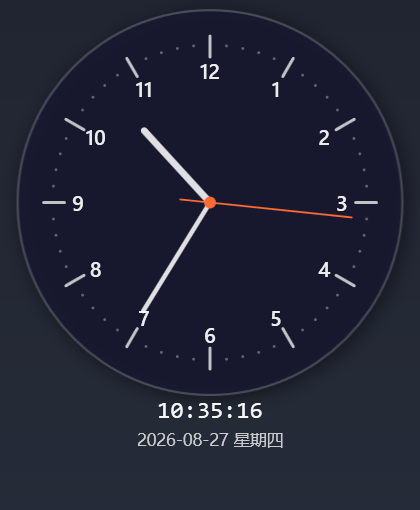

# TimeClock

一个轻量级的 Windows 桌面悬浮时钟，使用 WPF (.NET 9) 构建，始终置顶显示。


[English](README.md)



## 功能特性

- **始终置顶** — 透明无边框悬浮窗口
- **模拟时钟** — 12 个数字、60 个刻度、时针/分针/秒针
- **数字时间** — 显示在表盘下方
- **文字颜色自适应** — 数字时间和日期根据时钟背后的背景深浅自动切换深/浅色文字，任何壁纸下都清晰可见
- **日期显示** — 当前日期和星期
- **可拖拽** — 左键拖拽移动，自动记住位置
- **系统托盘** — 最小化到托盘，右键菜单操作
- **开机启动** — 通过注册表实现开机自动启动
- **秒针开关** — 在设置中显示/隐藏秒针
- **闹钟** — 设置窗口分"常规 / 闹钟"两个标签页，支持添加多个闹钟（时间 + 可选标签），到点时时钟晃动提醒，点击时钟可提前停止
- **日志记录** — 自动记录应用生命周期事件，存储在 `%APPDATA%/TimeClock/Logs/`

## 环境要求

- Windows 10/11
- .NET 9 SDK

## 构建与运行

```bash
dotnet build TimeClock
dotnet run --project TimeClock
```

## 使用方法

- **移动** — 左键拖拽时钟
- **设置** — 右键 → "设置..."
- **查看日志** — 右键 → "查看日志"
- **退出** — 右键 → "退出"

## 项目结构

```
TimeClock/
├── Helpers/
│   ├── Logger.cs              # 文件日志记录
│   └── SettingsManager.cs     # 设置持久化与开机启动
├── App.xaml / .cs             # 入口，托盘图标
├── MainWindow.xaml / .cs      # 悬浮时钟主窗口
├── SettingsWindow.xaml / .cs  # 设置窗口
├── LogWindow.xaml / .cs       # 日志查看窗口
└── GlobalUsings.cs
```

## 开源许可

基于 [Apache License 2.0](LICENSE) 开源。
